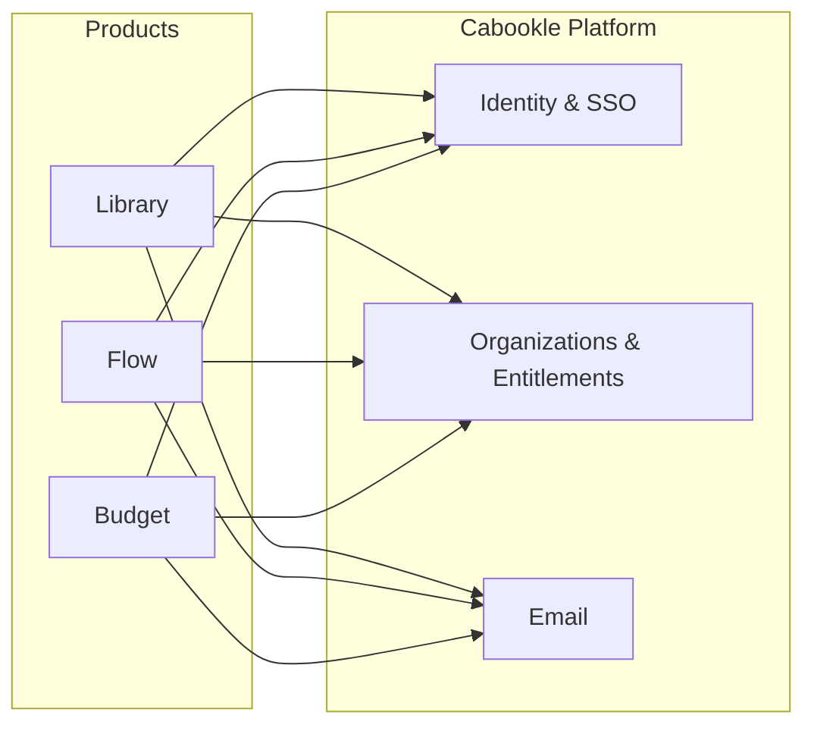

# Cabookle — Platform Case Study

> A public, read-only case study of the engineering behind **Cabookle** — a suite of free tools for
> teachers and school librarians — and the shared identity, authentication, and communication
> platform that ties them together.
>
> ⚠️ **This is a case study, not the production codebase.** Everything here was written from scratch
> for a public audience. It contains no source from the private Cabookle repositories, no credentials,
> no customer data, and no internal infrastructure details. Diagrams use synthetic data only.

---

## What is Cabookle?

Cabookle gives teachers and school librarians a set of practical tools that work together under a
single free account:

| Product | What it does | Who it's for |
|---|---|---|
| **Cabookle Library** | Catalog books by ISBN, track circulation and overdues, and help students discover what to read next — with AI-powered Smart Search and plain-English insights. | Teachers & school librarians running classroom collections and smaller school libraries |
| **Cabookle Flow** | A school-year-aware workspace for recurring tasks, templates, projects, events, book displays, and contacts — with automatic year-to-year rollover. | Teachers & school librarians |
| **Cabookle Budget** | Plan and track library spending across a full budget year: funding sources, allocations, planned purchases, vendor orders, receipts, and reports. | School librarians |

All three products are backed by a shared **Cabookle Platform** that owns identity, single sign-on,
organization and entitlement management, and transactional email.

## Why this repository exists

This repository is a **portfolio piece**. It documents how a small, production-grade, multi-product
SaaS platform was designed and operated — the architecture, the hard problems, and the decisions —
without exposing the private repositories, real users, or security-sensitive implementation details.

## What you'll find here

| Document | Contents |
|---|---|
| [Products](docs/products.md) | Deep dive on Library, Flow, and Budget |
| [Architecture](docs/architecture.md) | High-level architecture and component diagrams |
| [Deployment](docs/deployment.md) | Runtime topology and how it ships |
| [Technology stack](docs/tech-stack.md) | Stack choices and the reasoning behind them |
| [Multi-tenancy](docs/multi-tenancy.md) | Tenancy model and data-isolation approach |
| [Security](docs/security.md) | Authentication and security overview (no secrets) |
| [AI & natural language](docs/ai-insights.md) | AI-assisted insights and natural-language features |
| [Engineering problems](docs/engineering-problems.md) | Difficult problems solved and how |
| [Code samples](docs/code-samples.md) | Small, rewritten snippets that illustrate the ideas |
| [Operations](docs/operations.md) | CI/CD, monitoring, and production-support approach |

Diagrams are authored as [Mermaid](https://mermaid.js.org) — view them inline in the markdown or edit
the sources in [`diagrams/`](diagrams/). Synthetic UI mockups live in [`screenshots/`](screenshots/).

## Technology at a glance

- **Backend** — .NET 8, ASP.NET Core, EF Core (MySQL via Pomelo)
- **Data** — MySQL
- **Email** — Resend
- **Frontend** — Svelte 5 + Vite + Tailwind CSS
- **Auth** — JWT (shared secret) + server-side sessions with an HttpOnly cookie
- **CI/CD & security** — GitHub Actions (NuGet publish, Semgrep SAST, GitLeaks secret scan, Dependabot)
- **Hosting** — Railway

See [Technology stack](docs/tech-stack.md) for the full rationale.

## A quick tour

1. A user registers once and verifies their email; the platform provisions their **organization** and
   entitlements to Library, Flow, and Budget automatically.
2. Signing in sets a single HttpOnly session cookie on the shared domain, so every product can silently
   validate the session and move the user between products without re-entering credentials.
3. Product services never send email themselves — they hand messages to the platform, which queues them
   in an outbox and delivers them reliably with retries.

For the full picture, start with the [Architecture](docs/architecture.md) document.

---

*Written as a public case study. No production code, secrets, or real data are included.*
