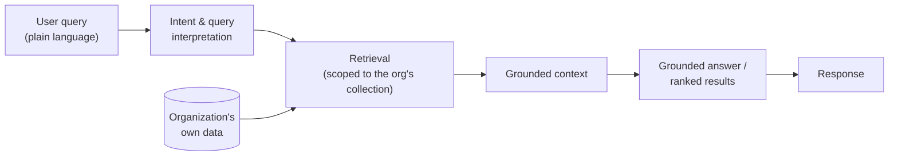

# AI-Assisted Insights & Natural-Language Features

Cabookle Library includes AI-assisted features that let students and staff interact with their
collection in plain English. This document describes what those features do and sketches, at a high,
**illustrative** level, how they are architected.

> ⚠️ The implementation details below are **generalized and illustrative**. They describe the
> architectural approach, not the private product code.

---

## The features

### Smart Search

Students describe what they want to read in natural language, *"graphic novels about friendship"* or
*"Newbery winners with animals"*, and get results **from the school's own collection**, not the open
internet.

### Plain-English insights

Staff ask questions about their data, *"Which books have never been checked out?"* or *"Who has the
most overdue books?"*, and get a clear written answer instead of having to build and parse a report.

### The unifying constraint: answers stay in the collection

Both features share one non-negotiable property: **the model reasons over the organization's own data,
and only ever recommends books the library actually owns.** That grounding is what makes the feature
safe and useful, a student is never told to read a book that isn't on the shelf.

---

## Illustrative architecture

The general shape is a **retrieval-then-generate** pattern scoped to one organization:

### What each stage does (conceptually)

1. **Interpretation.** The query is turned into a structured intent: is this a *search* ("find me
   books like X") or a *question* ("how many of my books are overdue")?

2. **Retrieval.** Rather than asking the model to invent facts, the system first retrieves a small,
   relevant slice of the organization's own records, candidate titles and their metadata for search,
   or aggregated circulation data for an insight.

3. **Grounding.** The model is constrained to answer using only the retrieved context. For search,
   this means re-ranking the organization's own titles against the query; for insights, it means
   producing a written answer derived from the retrieved numbers.

4. **Generation.** The model produces a natural-language answer or an ordered list, always citing the
   organization's own data.

### Why this shape matters

- **No hallucinated inventory.** Because retrieval is scoped to the tenant before generation, the
  system cannot recommend a book the library doesn't have.
- **Privacy by construction.** The retrieval boundary is the organization, the model never sees other
  tenants' data.
- **Deterministic fallback.** If a query can be answered directly (e.g. "books checked out to one
  student"), it can be answered without a generative step at all, keeping the model on a short leash.

---

## Hard problems this raised

The grounding constraint created a few genuine engineering challenges, covered in
[Engineering problems](engineering-problems.md):

- Keeping retrieval strictly **tenant-scoped** (the same isolation invariant as the rest of the
  platform, now applied to an AI pipeline).
- Avoiding **hallucinated recommendations** by forcing generation to use retrieved context only.
- Making responses **cheap and fast** by answering directly when a deterministic query path exists.
