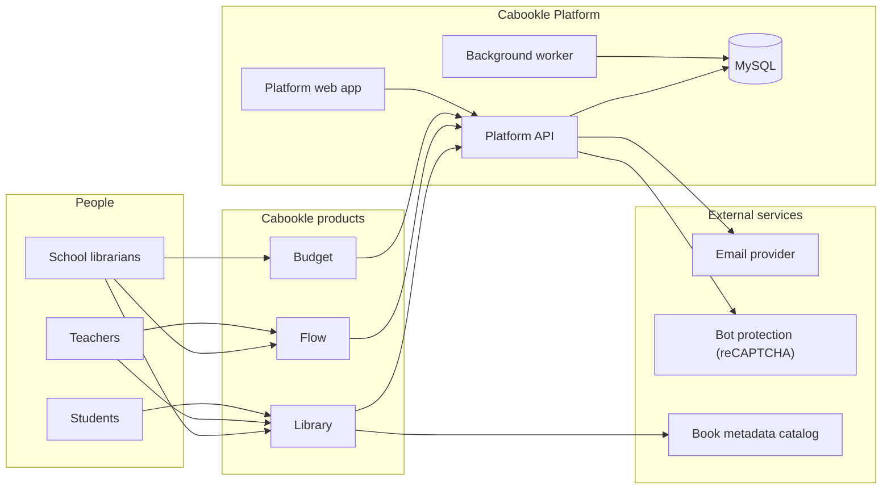
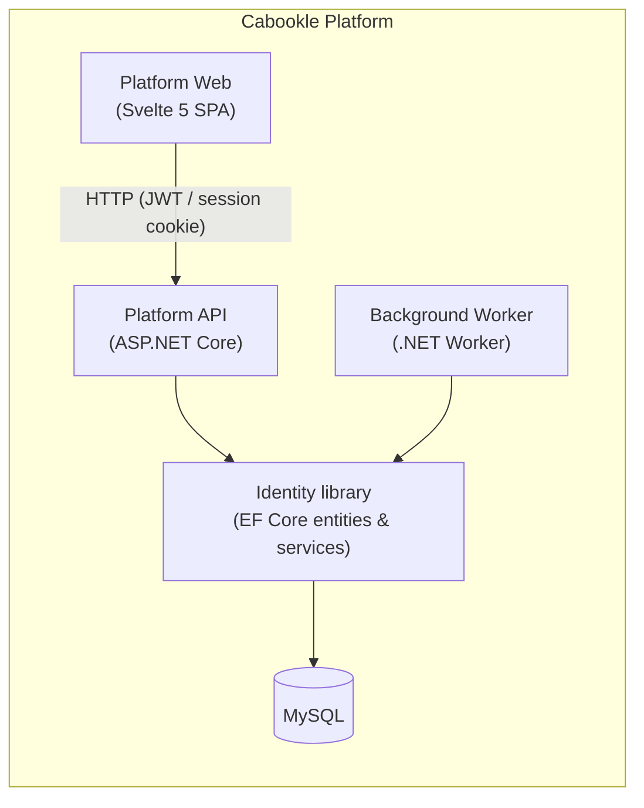
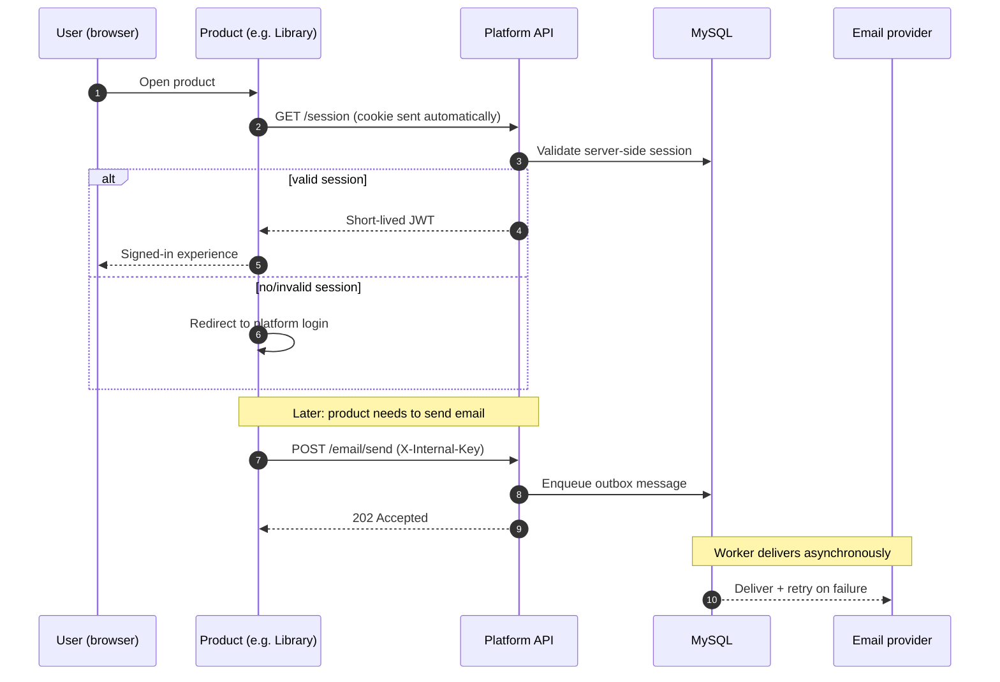

# Architecture

This document describes the high-level architecture of the Cabookle suite: the system context, the
components of the platform, and how the products consume it.

> Diagrams are authored in Mermaid. The same sources live in [`diagrams/`](../diagrams/).

---

## 1. System context

### What it shows

- **Products are separate applications** that all call the same platform API for identity, session,
  and email.
- **The platform is the single source of truth** for users, organizations, and entitlements.
- **External dependencies are narrow** — one email provider, one bot-protection provider, and a book
  metadata catalog used only by Library.

---

## 2. Platform components

### Responsibilities

| Component | Responsibility |
|---|---|
| **Platform API** | Auth endpoints (register, verify, login, logout, session, me), admin endpoints, contact form, and the internal email relay. Owns middleware for security headers, rate limiting, and internal API-key validation. |
| **Platform Web** | The user-facing single-page app for login, registration, dashboard, and account management. |
| **Background Worker** | Runs the email outbox: picks up queued messages and delivers them with retries, separate from the request path. |
| **Identity library** | A reusable class library with EF Core entities, the `DbContext`, and identity services (password hashing, tokens, sessions). Consumed by the API and Worker, and published as a package for other services. |
| **MySQL** | Relational store for users, organizations, memberships, entitlements, sessions, and the email outbox. |

The separation of **Identity** into its own library is deliberate: it keeps identity logic free of
hosting concerns and lets multiple processes (API + Worker) share one implementation without
duplication.

---

## 3. How a product consumes the platform

Key ideas:

- **No token in the URL.** The browser's HttpOnly cookie is sent automatically to the shared domain,
  and the platform exchanges it for a short-lived JWT.
- **Email is fire-and-forget for the caller.** Products enqueue; the platform owns reliable delivery.
