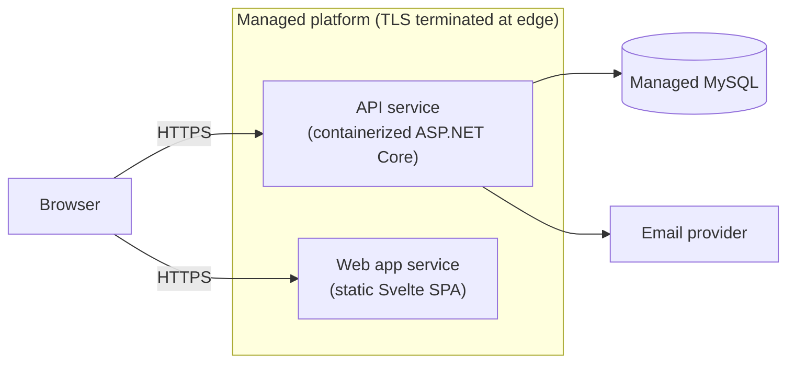
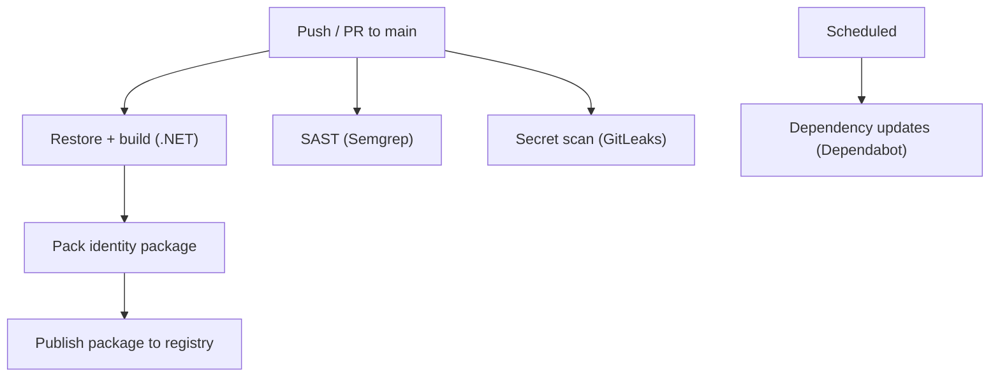

# Deployment & CI/CD

This document describes how the Cabookle platform is shipped: the runtime topology, the build and
deploy pipeline, and the automated security/dependency checks.

> All names below are illustrative. No real environment identifiers, credentials, or hostnames are
> included.

---

## Runtime topology

The platform is deployed as **separate services** on a managed platform (Railway):

| Service | What it is | Notes |
|---|---|---|
| **API service** | The ASP.NET Core API | Containerized (multi-stage Docker build, or nixpacks); listens on an internal HTTP port while the edge terminates TLS. |
| **Web app service** | The Svelte SPA | A static build; configuration is baked in at build time. |
| **Managed MySQL** | The database | Provisioned by the platform; connection details supplied via environment variables. |

### Deployment characteristics

- **Self-contained migrations.** On startup, the API applies EF Core migrations, so a deploy never
  needs a separate migration step.
- **Two build paths, one approach.** The API uses a multi-stage Dockerfile (or nixpacks) to produce a
  small runtime image; the worker shares the same build strategy.
- **Secrets via environment.** JWT signing key, email API key, database connection string, and
  internal service keys are all injected as environment variables; nothing secret lives in the repo.
- **Shared cookie domain.** The session cookie is scoped to the parent domain, so every product
  subdomain can share a single session automatically.

---

## CI/CD pipeline

GitHub Actions drives the pipeline:

### What runs and when

| Job | Trigger | Purpose |
|---|---|---|
| **Build & publish** | push to `main`, version tags, PRs | Build the solution, pack the identity library, and publish it as a versioned package (`--skip-duplicate` avoids redundant versions). |
| **SAST (Semgrep)** | push/PR, weekly, manual | Static analysis; results uploaded as SARIF to the security tab. |
| **Secret scan (GitLeaks)** | push/PR, manual | Block secrets from ever landing in history. |
| **Dependabot** | scheduled | Keep NuGet, npm, and GitHub Actions dependencies current, grouped and labeled for easy review. |

### Why these checks

- **Publishing as a package** means the identity library can be consumed by other services without
  copying code.
- **Secret scanning + SAST + dependency updates** run automatically so security hygiene isn't a manual
  chore, important when the code is a public showcase.
